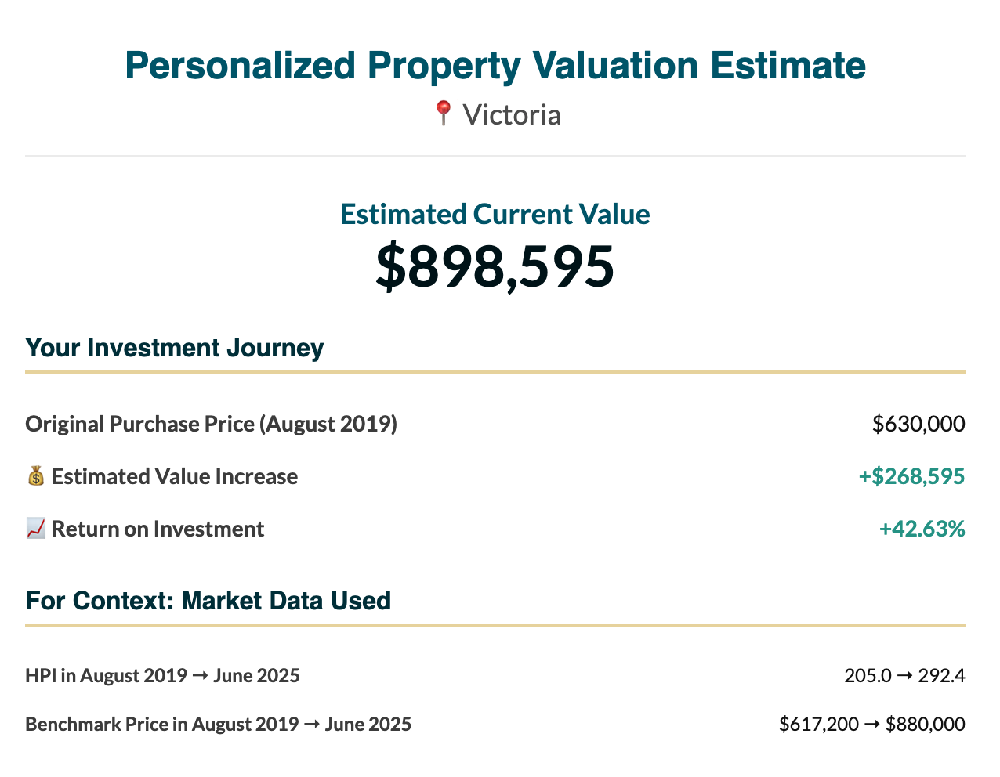

# Cdn-HPI-Valuator 🇨🇦🏠

A Python tool to estimate the current market value of a Canadian property based on its purchase price and date, using historical data from the CREA MLS® Home Price Index (HPI).



---

## 🌟 Key Features

*   **Personalized Valuation:** Estimates the current value of *your specific property*, not just the market benchmark.
*   **Address Validation & Geocoding:** Uses the Google Geocoding API to standardize and validate user input, correcting for potential errors in postal codes or municipalities before extracting the correct location data.
*   **Robust Fuzzy Matching:** A smart algorithm correctly maps messy real-world location names (e.g., "Montréal") to the corresponding dataset (e.g., `MONTREAL_CMA`).
*   **Hierarchical Fallback System:** If a specific city's data isn't available, it automatically falls back to the provincial or even national aggregate data, ensuring a result is always returned.
*   **Professional HTML Reports:** Generates a clean, visually appealing, and shareable HTML report card for each analysis.

---

## ⚙️ How It Works

The script follows a simple yet powerful five-step process:

1.  **User Input:** Takes a property address, its original purchase price, and the purchase month/year.
2.  **Geocoding:** The address is sent to the Google Geocoding API to retrieve the standardized city (`locality`) and province (`administrative_area_level_1`).
3.  **Sheet Matching:** The geocoded city name is intelligently matched against the available locations (Excel tabs) in the CREA HPI file. The matching logic handles accents, suffixes (like `_CMA`), and prefixes (like `GREATER_`) to find the correct dataset.
4.  **HPI Calculation:** The script retrieves the HPI value from the purchase date and the most recent HPI value. It then calculates the growth ratio and applies it to the user's original purchase price.
5.  **Report Generation:** All the calculated data is formatted into a polished, self-contained HTML report with conditional coloring for positive (green) or negative (red) returns.

---

## 🚀 Setup and Usage

This project is designed to run in a Google Colab environment.

### **1. Prerequisites**
*   A Google Account (for Colab and Google Drive).
*   The CREA HPI Excel file (download from https://www.crea.ca/housing-market-stats/mls-home-price-index/hpi-tool/).
*   A Google Geocoding API Key.

### **2. Configuration**

1.  **Upload Data to Google Drive:**
    *   Upload your CREA HPI Excel file to your Google Drive (e.g., into a folder named `data/mls/`).
    *   Note the file path (e.g., `/content/drive/MyDrive/data/mls/hpi_sa.xlsx`).

2.  **Set Up Google API Key:**
    *   In your Colab notebook, click the **key icon (🔑)** in the left sidebar to open "Secrets".
    *   Create a new secret with the name `GOOGLE_API_KEY`.
    *   Paste your Google Geocoding API key as the value.

3.  **Install Libraries:**
    *   Run the following command in a Colab cell to install the required Python packages:
    ```python
    !pip install pandas openpyxl googlemaps fuzzywuzzy python-levenshtein
    ```

### **3. Running the Analysis**

1.  Copy the complete Python script into a single Colab cell.
2.  Update the `HPI_FILE_PATH` variable to match the path of your file in Google Drive.
3.  Modify the example usage at the bottom of the script to analyze your own properties:
    ```python
    analyze_property_value(
        address="YOUR_ADDRESS_HERE",
        purchase_date_str="YYYY-Mon" # e.g., "2020-Mar"
        user_purchase_price=YOUR_PURCHASE_PRICE # e.g., 750000
    )
    ```
4.  Run the cell to see the generated HTML report!

---

## 🛠️ Technology Stack

*   **Language:** Python
*   **Core Libraries:**
    *   `pandas`: For data manipulation and reading Excel files.
    *   `googlemaps`: Official Python client for Google Maps API services.
    *   `fuzzywuzzy`: For robust fuzzy string matching.
*   **Environment:** Google Colab
*   **Data Source:** CREA MLS® Home Price Index (HPI)

---

## 🔮 Future Improvements

*   **Portfolio/Batch Analysis:** Allow users to upload a CSV file containing multiple properties (addresses, purchase prices, dates) to perform a full portfolio valuation in a single run.
*   **Support for Multiple Data Vendors:** Adapt the data ingestion module to work with other paid, high-resolution data sources like Teranet or Moody's Analytics, allowing for even more granular and precise valuations.
*   **Support for Property Types:** Extend the logic to analyze different property types (Single Family, Townhouse, Apartment) using the corresponding HPI columns.
*   **Interactive Web Interface:** Build a simple web application using Streamlit or Flask to make the tool accessible to non-technical users.
*   **Data Visualization:** Generate and embed charts showing the HPI trend over time for the matched location.
*   **Automated Data Updates:** Write a script to automatically download the latest HPI data from the CREA website.

---

## 📜 License

This project is licensed under the MIT License. See the `LICENSE` file for details.
